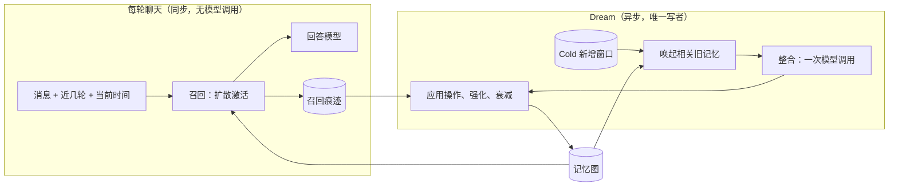

# Conversation Memory 重设计

Sep 25, 2026 · @Raven · 实现任务见 [TASK_CARD.md](TASK_CARD.md)

在 Dream 里，把你和 Lumina 的大量对话整合成少量要点记忆，这些记忆会强化，也会淡忘。每轮聊天只做本地计算，在记忆图上扩散激活来召回；联想不是一个开关，而是召回的性质。本稿只设计 Conversation Memory，人设演化和任务经验（experience 模块）不在范围内。

## 1. 目标与约束

核心目标只有两个：联想，以及活人感（类似人的连续性和抽象理解）。精确性排在后面。

| 要求 | 你的原话要点 | 设计上的含义 |
| --- | --- | --- |
| 联想 | 联想不是显式功能，是记忆召回的性质；用途优先级：理解当下 > 创造 > 自发提起 | 召回本身就是扩散激活；另留一个“远联想”位 |
| 活人感 | 类人的连续性与抽象理解 | 常驻的“心上之事” + 要点记忆 + 按使用强化、按时间淡忘 |
| 记忆是归纳 | 大量低密度对话变成少量高密度记忆；归纳不是单独步骤 | 写入即整合：新经历并入已有记忆，而不是逐条追加 |
| 可以出错 | 理解可以错，精确性可以差一点 | 不做逐条核验，只在正文里保留说话人 |
| 遗忘 | 原文永久存储，超过时间窗 Lumina 不可查；类似人脑，会淡化、合并、重塑 | 时间窗内原文可查；窗外只能通过记忆 |
| 范围 | 只处理对话；思考和行动会体现在对话里；任务经验另有 experience 模块 | 不接 Mind / Execution；人设演化以后另做 |
| 异步 | 保留 Hot / Cold / Dream；只在 Dream 时处理 Cold 的新增内容 | 聊天路径不调用模型、不写记忆 |
| 可替换 | 现有组件都可以废弃 | 从头设计，只保留 Hot / Cold / Dream 的外壳 |
| 评测 | 改为自动评测；评测器要能修改时间戳 | 见第 9 节 |
| 用法 | 显性或隐性属于提示词问题 | 本稿不设计提示词措辞 |

已确认：“归纳不是单独步骤”指的就是抽象属于写入本身的性质，所以不另设反思或归纳阶段。

## 2. 设计原则

六条原则都直接来自上表的要求，后面各节只是它们的具体化。

1. **记忆单元是“要点”。** 一到三句话，表达她从对话里记住的东西：一件事、一个规律、一次变化、一个没聊完的话题、她自己的一个看法。不分类型，也不是事实三元组。
2. **写入即整合。** 新经历先唤起相关的旧记忆，再由一次模型调用决定：新增、改写、合并，还是只强化。记忆总数应该比对话量增长得慢得多。
3. **联想即召回。** 召回就是在多层图上扩散激活，没有单独的联想模式。
4. **遗忘是一等机制。** 强度随时间按幂律衰减、因使用而增强；低于阈值就想不起来。数据仍在，可以从 Cold 重建。
5. **先验的是坐标系，涌现的是内容。** 语义、时间、实体、事件这四个联想维度是预先定好的；哪些记忆相连、连得多强，全部由对话和使用长出来。不设经历节点，也不预设关系类型。
6. **模型只出现在 Dream 里。** 聊天路径只做本地的向量和图计算。主动回想（由回答模型发起的结构化召回）后续再做。

## 3. 总体结构

两条路径只通过记忆图和召回痕迹交互：聊天只读图，Dream 是唯一的写者。



回答模型看到三层内容：Hot 的最近 12 轮原文和滚动摘要（照旧），记忆图召回的要点，以及时间窗内 Cold 原文的命中。时间窗以外的原文它看不到。

读写一致性：Dream 在一个事务里写完所有更改并递增版本号；聊天侧始终读一个完整的版本快照，发现版本变化后再整体换入新快照，不会读到写到一半的图。

## 4. 数据模型

数据模型只有三样：两类节点、四层边、一份召回痕迹。全部存在一个 SQLite 文件里（事务原子、在 Windows 上可靠），启动时把向量矩阵和各层稀疏邻接矩阵载入内存。单用户多年大约是 10⁴ 条记忆的量级，直接暴力计算即可。

**记忆节点**

| 字段 | 含义 |
| --- | --- |
| text | 要点正文，中文，用 Lumina 的视角写（“他……”“我……”），1–3 句 |
| embedding | 本地多语言模型算出的向量 |
| occurrences | 出现时间列表，即它的时间坐标。每当它被形成、改写、合并或印证，就记下对应那段对话的真实时间（取自 Cold 时间戳，由程序记录） |
| events | 强化事件：除了出现时间，还包括每次被召回的时间；用来计算强度 |
| salience | 整合时给出的初始分量，1–3 |
| entities | 涉及的实体 ID |
| sources | 来源的 Cold 段和轮次，只供开发调试和重建使用，不给 Lumina |
| lineage | 改写前的各个版本，以及合并来源 |

**实体节点**：表示一个人、物、地点或项目，只有名字和别名列表，不含正文。它由整合时的模型标出，并对齐到已有实体。对某个人的理解，是一条与该实体相连的普通记忆。你和 Lumina 本身不作为实体，因为几乎每条记忆都涉及你们。

**四层边**

| 层 | 连接 | 来源 | 方向 |
| --- | --- | --- | --- |
| 语义 | 记忆–记忆 | 向量近邻：每条保留最相近的 k 条，且余弦高于阈值。每次 Dream 结束时重算 | 无 |
| 时间 | 记忆–记忆 | 由出现时间直接算出：两条记忆的出现时间相距在 3σ 以内才连边，权重随时间差指数衰减 | 无 |
| 实体 | 记忆–实体 | 整合时标出的实体 | 无 |
| 事件 | 记忆–记忆 | 三种来源叠加：共现统计、模型看出的关系、共同抽象（见第 7 节） | 部分有 |

每个记忆节点在每一层只保留权重最高的 M 条边。

**召回痕迹**：每轮聊天追加一行，记录时间，以及进入了上下文的记忆 ID 和分数。这是聊天路径唯一的写入，由 Dream 消费。

## 5. 写入：Dream 中的整合

每个 Cold 新增窗口只调用一次模型，输出一组对记忆图的操作，没有核验阶段。所谓“归纳”，就是把新经历并入已有记忆这个动作的结果。

**触发**：按新增量。Cold 中未整合的内容达到阈值（如 40 轮）就在后台串行执行。只有一个写者，与聊天完全异步。对话少的时期整合会滞后，但这段内容仍在 Hot 或原文时间窗里，不影响召回。

1. **取窗口**：取 Cold 中尚未整合的连续轮次，每批不超过约 40 轮。有积压时按时间顺序分多批处理。
2. **唤起**：把窗口每几轮切成一段作为线索，用与聊天相同的多层召回取出相关旧记忆，上限 30 条。同时把与窗口高度相似的记忆也放进来，防止重复新增；再附上窗口里出现的已知实体。
3. **整合**：调用一次模型。输入是窗口原文（带时间和说话人）、相关旧记忆（ID、正文、大致年龄、强度）、已知实体和当前时间，输出是下表中的操作列表。new、revise、merge 还要标出这条记忆涉及的实体：能对上已有实体就用已有 ID，对不上就新建。
4. **应用**：先把模型的原始响应持久化，再确定性地执行操作。被操作的记忆追加一个出现时间，取的是来源对话的真实时间。重试时复用同一份响应，不重复调用模型。
5. **更新各层**：更新共现统计，重算受影响的时间边和语义边，并消费自上次 Dream 以来的召回痕迹（见第 7 节）。
6. **收尾**：把该窗口在 Cold 中标记为已整合。

| 操作 | 作用 | 对应的认知过程 |
| --- | --- | --- |
| new | 新增一条要点 | 记下一段新经历 |
| revise | 用新信息改写一条旧记忆 | 再巩固：记忆在被想起时被重塑 |
| merge | 几条合并成一条更抽象的要点；旧条目保留但淡出得更快 | 多次经历归纳出一个规律 |
| touch | 旧记忆被这次经历印证，内容不变 | 强化 |
| relate | 指出两条记忆之间的联系，不限种类：延续、结果、起因、同类、常一起发生等。有先后就标方向；可以附一句说明供调试用，不参与计算 | 注意到事与事之间的联系 |

整合提示词的要点：

- 写要点，不写流水账；纯闲聊通常什么都不写。
- 优先并入已有记忆，其次才新增。反复出现的事改写成规律，比如“他常在深夜做实验”。
- 变化写成变化（“他原本打算……，后来改为……”）；没完成的事要写明还没完成；没发生的事要写明没发生。
- 知道原因时，把原因写进记忆，并用 relate 连上。
- 她自己的看法和判断用“我”记下；不确定的就用不确定的措辞。
- 数字、名字、日期这类具体细节，只在看起来重要时保留。

## 6. 召回：多层扩散激活

每轮召回由三件事组成：一次查询编码；从三个通道找起点；在四层图上做 K 次稀疏矩阵乘法。在 10⁴ 条记忆的规模下，除编码外都是毫秒级，不调用模型。

**线索**：当前消息 + 最近几轮 + 当前时间，编码为 q。

**起点：三个通道**

| 通道 | 怎么找 | 起点落在 |
| --- | --- | --- |
| 语义 | 与所有记忆算余弦，取前 S 条，得到 r\_S | 记忆节点 |
| 时间 | 本地解析线索里的中文时间表达（昨天、上周末、前几天晚上……），得到一个时间区间。出现时间落在区间内的记忆得 1，区间外的按距离衰减，得到 r\_T。没有时间表达就没有这一路 | 记忆节点 |
| 实体 | 在线索里匹配已知实体的名字和别名，得到 r\_E。当前消息权重高，最近几轮权重低 | 实体节点 |

三路合起来归一化，作为起点：

```latex
a^{(0)} = \frac{\alpha_S r_S + \alpha_T r_T + \alpha_E r_E}{\lVert \alpha_S r_S + \alpha_T r_T + \alpha_E r_E \rVert_1}
```

**强度与可及度**：基础激活采用 ACT-R 的形式。t\_k 是每次强化的时间，w\_k 是该次强化的权重。时间以天为单位，间隔下限取 1 小时。可及度 π 表示“还想不想得起来”，与线索无关。

```latex
B_i(t) = \ln \sum_k w_k \,(t - t_k)^{-d} \;+\; \ln s_i
```

```latex
\pi_i = \sigma\!\left(\frac{B_i(t) - \tau}{\theta}\right)
```

**多层扩散**：先把每层各自归一化成转移矩阵 P⁽ˡ⁾，再逐个节点按层权重 w\_ℓ 混合。L(i) 是节点 i 有边的那几层。

```latex
P_{i\cdot} = \frac{\sum_{\ell \in L(i)} w_\ell\, P^{(\ell)}_{i\cdot}}{\sum_{\ell \in L(i)} w_\ell}
```

- **语义层、时间层**：按行归一化边权。
- **实体层**：记忆到实体，按这条记忆涉及的实体数均分；实体到记忆，按这个实体的连接数均分。一个只出现过三次的名字传导很强，常见实体的激活被摊薄。
- **事件层**：有方向的边正向权重为 1，反向乘以 ρ < 1，对应人回忆的前向不对称；无方向的边双向相同。

然后迭代 K 步扩散，最后乘上可及度得到分数。分数只对记忆节点输出，实体节点只负责传导。

```latex
a^{(k+1)} = (1-\lambda)\,a^{(0)} + \lambda\,P^{\top} a^{(k)}
```

```latex
\mathrm{score}_i = a_i^{(K)} \cdot \pi_i
```

相乘带来两个效果。已经淡忘的记忆，即使和线索相关也很难浮现。但它仍然能当桥梁传导激活，因为扩散过程本身不乘 π。

**输出四部分**，分别对应你定的优先级：

| 部分 | 选法 | 对应目标 |
| --- | --- | --- |
| 近联想 | 按分数取前 k 条，用 MMR 去掉几乎重复的 | 理解当下（优先级最高） |
| 远联想 | 只在“主要靠扩散到达”的节点（与线索语义相似度低、激活高）里取最高的 1 条，超过阈值才给 | 创造 |
| 心上之事 | 与线索无关，按 B\_i 取前 m 条常驻上下文，即最近反复出现或刚被强化的事 | 连续性 |
| 时间窗原文 | 在窗口 W 内的 Cold 原文里，按向量加中文二字切分检索；线索带时间表达时，直接取那段时间的原话 | 记得你最近说过的话 |

“心上之事”不是预设字段，就是此刻强度最高的几条记忆。“自发提起”排在最后一位，不单独设位置，由提示词决定是否说出来。“后来”“为什么”这类需要理解才能选定方向的线索，在主动回想做出来之前，只能靠事件层双向扩散。输出渲染成一个记忆块：要点加粗略时间，如“约两周前”“最近常提”。最后追加一行召回痕迹。

## 7. 遗忘与生长

记忆的强弱由两件事决定：多久没被用到，以及被用过多少次。图的形状由对话和使用决定，每一层的边都来自经历，而不是人为规定。

**强化事件**（写入 events，进入公式里的 B\_i）

| 事件 | 权重 w\_k |
| --- | --- |
| 形成（new） | 1.0 |
| 被改写、被合并成新条目、被印证（revise / merge / touch） | 1.0 |
| 在聊天中被召回并进入上下文 | 0.5 |

被想起本身就会加强记忆，这对应认知心理学里的检索练习效应。merge 生成的新条目继承所有父条目的强化事件和出现时间，所以一出生就是强的；父条目的 salience 减半，淡出得更快。

**事件层的三种来源**：事件联想不限种类，所以不按关系类型建边，而是叠加三种通用机制。任何一种关系，都至少会被其中一种捕捉到。

| 来源 | 怎么来 | 长出的联想 | 例子 |
| --- | --- | --- | --- |
| 共现统计 | 程序统计：两条记忆是否比偶然更常在同一时段（如同一天）出现，不用模型 | 常一起发生的事 | 做实验 ↔ 熬夜赶工 |
| 模型看出的关系 | 整合时的 relate 操作，有先后就带方向 | 同一件事的前后发展、起因、结果 | 计划 → 执行 → 结果 |
| 共同抽象 | merge 产生的抽象要点与它的来源实例相连 | 同一类事 | 两次熬夜赶工，经“他常熬夜赶工”两跳相连 |

此外，同一轮聊天里一起被召回的记忆，在事件层上各加 β。

共现用正点互信息（PPMI）衡量，并对小样本打折。N 是时段总数，n\_i 是记忆 i 出现过的时段数，n\_ij 是两者同时出现的时段数：

```latex
w_{ij} = \max\!\left(0,\ \ln \frac{n_{ij}\, N}{n_i\, n_j}\right) \cdot \left(1 - e^{-n_{ij}/\kappa}\right)
```

每天都出现的常驻话题，互信息自然很低，不会和一切相连。只同时出现过一次的，也不会立刻连得很强。

时间层和共现的区别在于次数。时间层记的是一次相邻：“那天还聊了什么”。共现记的是多次相邻的累积：“这两件事总是一起出现”。后者正是具体经历沉淀成一般认识的方式。

**衰减与度上限**：事件层的边随时间衰减，w ← w·exp(−Δt / T\_e)，低于 ε 就删除。语义、时间、实体三层由内容和坐标直接算出，本身不衰减；记忆的淡忘由可及度 π 体现。每个节点每层只保留权重最高的 M 条边。行归一化加上实体按连接数均分，防止高频记忆和常见实体变成枢纽。

**遗忘**：不删除任何节点。π 持续低于 π\_min 超过 T\_d 的节点转为沉睡，不再充当起点，但仍可在扩散中当桥梁。一旦新经历把它唤起并 touch，它就重新活过来。所有数据都能从 Cold 重建。

**各项能力从哪里长出来**

| 能力 | 生长路径 |
| --- | --- |
| 理解你 | 反复出现的事被 revise 或 merge 成规律，强度随每次印证累积 |
| 经验迁移 | 共同抽象把同类经历连起来；共现把常一起发生的事连起来 |
| 挂念未完成的事 | 未完成的事被写成“未完成”，每次被提起都得到强化，完成时被 revise |
| 自我叙事 | 她的看法以“我”记下；被新经历推翻时 revise，旧版本留在 lineage 里 |
| 连续性 | 心上之事常驻上下文；时间层带出“那段时间”的其他事；再加上 Hot 的近期对话和时间窗内的原文 |

## 8. 走一遍：深夜场景

这是你给出的那个具体时刻，在新设计里有两条独立的路径能走通。

1. **第 1 周**：你聊实验安排时随口提到“晚上会做实验到很晚”。Dream 整合出一条 new：“他晚上常做实验到很晚。”
2. **第 3 周**：你在凌晨说数据还没跑完。Dream 唤起上一条，把它 revise 成“他经常深夜还在做实验，最近在赶数据。”强度随之累积。几周里“做实验”和“熬夜赶工”总在同一天出现，共现统计在事件层上把它们连了起来。
3. **第 5 周，周五凌晨 1:10**：你发来“好累”。线索是“好累”加上最近几轮，再加上“现在是周五凌晨 1:10”。
   - 路径一：线索中的“凌晨”“好累”与“深夜还在做实验”“熬夜赶工”在语义上接近，直接被命中。
   - 路径二：这条记忆被强化过多次，很可能本来就在“心上之事”里。
   - 激活再沿事件层扩散到与它常一起出现的事，比如“在赶哪个项目的数据”。
   - 如果你说的是“昨天的实验怎么样了”，时间通道会把“昨天”解析成区间，直接命中昨天出现过的记忆和原话。
4. 回答模型看到这些要点，可以回应：“实验还没收尾？先把数据存好，剩下的明天再看。”

有一个前提：回答模型自己也要看到当前时间。这属于提示词改动，但评测时两组必须保持一致。

## 9. 自动评测

评测全自动：评测器在模拟时钟下回放剧本、触发 Dream，在指定时刻发出探针并打分。评测器和评估集已定；回答层用哪个模型评判还未定。

**评测器**

- **模拟时钟**：Hot、Cold、Dream 和召回都从同一个时钟接口取时间，不直接读系统时间。
- **可修改时间戳**：剧本里每轮都带时间戳。评测器可以整体平移、拉伸间隔，或在探针前插入一段空白（如 1 天、2 周、2 个月），用来测淡忘曲线。
- **按真实规则回放**：逐轮写入 Hot，按原有规则压缩进 Cold，按新增量触发 Dream。
- **探针**：在指定的模拟时刻发出一条消息，记录召回结果和回答。
- **缓存 Dream 响应**：以窗口内容、提示词版本和模型为键。只改召回侧的阶段，以及只改探针前空白长度的实验，都直接复用缓存。这样比较更精确，也不重复花钱。为此，整合输出从阶段 1 起就包含实体和 relate 字段，即使前几个阶段还用不到。
- **可重复**：同一剧本、同一缓存、同一参数，记忆层结果逐字节一致。

**评估集**（已写好，见 `eval_set/`）：三份虚构的第一人称剧本，每份跨 6 周、约 28 次对话，各有 30 条带时间戳的探针。保留集只在最终报告时跑一次。每条探针带有应浮现的轮次、不应只凭它浮现的干扰轮次，以及回答层的评分要点。

| 集合 | 人物 | 规模 |
| --- | --- | --- |
| dev-a（开发） | 生物学博士生，细胞实验常到深夜，养猫 | 29 次对话，546 轮 |
| dev-b（开发） | 自由插画师，接外包，养狗 | 28 次对话，424 轮 |
| holdout-c（保留） | 高三物理老师，周末修摩托车 | 28 次对话，388 轮 |

| 探针类别 | 每份条数 | 例子 | 专门设置的干扰 |
| --- | --- | --- | --- |
| 理解当下 | 3 | 凌晨发“好累” | — |
| 时间 | 4 | “上周三晚上我在干嘛” | 别的周三做过同样的事；别的日子说过“昨天” |
| 实体 | 3 | “小周今天又闯祸了” | 同名的另一个人；消失三周的人重新出现 |
| 远联想 | 3 | 新秤说胖了三公斤 → 以前先核对仪器 | 其中两条只靠共现（对话里从未说破），计为加分项 |
| 接续 | 3 | “那首曲子练顺了” | — |
| 变化 | 2 | “这周末能投稿了吧” | 只含旧计划的记忆 |
| 否定 | 2 | “我是不是好久没出去玩了” | 别人去了同一个地方 |
| 自己的看法 | 3 | “你之前不是说……” | 她后来修正过的看法 |
| 淡忘 | 3 | 间接提到一次性闲聊 | 加 60 天后不应浮现 |
| 保留 | 2 | 反复出现的习惯 | 加 60 天后仍应浮现 |
| 对照 | 2 | 翻译一个术语 | 不应硬扯往事 |

构建脚本会检查：每条探针的标准答案不能全部还留在探针时刻的 Hot 里，否则测不到记忆。三份集合目前全部通过，没有一条探针的标准答案在 Hot 里可见。

**指标**（草案）

- **记忆层**（确定性，不用模型）：该浮现的来源轮次，是否被召回记忆的 sources 覆盖；不该浮现的（错误时间、同名他人、应已淡忘的闲聊）是否出现；远联想是否命中；记忆条数的增长曲线；重要信息与闲聊细节各自的保留曲线。
- **回答层**（模型评判）：讨论中。

## 10. 实验顺序与参数初值

每个阶段只多加一个机制，并与上一阶段对照，这样每个机制的收益都能单独看清。每个阶段都跑完整的自动评测。阶段 2–6 只改召回侧，直接复用阶段 1 缓存的 Dream 响应。

| 阶段 | 这一阶段加入的东西 | 对照 | 主要看的探针 |
| --- | --- | --- | --- |
| 0 | 评测器（模拟时钟）与评估集 | — | 能跑通 |
| 1 | 整合写入 + 强度衰减 + 语义召回（没有图） | 只有 Hot | 理解当下、变化、淡忘 |
| 2 | 心上之事常驻上下文 | 阶段 1 | 接续、理解当下 |
| 3 | 时间坐标：时间通道 + 时间层 | 阶段 2 | “昨天”“上周”一类、接续 |
| 4 | 实体：实体通道 + 实体层 | 阶段 3 | 涉及具体人和物的探针 |
| 5 | 事件层：relate + 共同抽象 | 阶段 4 | 理解当下、远联想 |
| 6 | 事件层：共现统计 + 共同召回强化 + 远联想位 | 阶段 5 | 远联想 |
| 7（推迟） | 回放：推迟，以后与 Dream 中的记忆整理一起做 | 阶段 6 | 远联想 |

下面是作为工程起点的参数初值，不是最优值，只在开发集上调。

| 参数 | 初值 | 说明 |
| --- | --- | --- |
| d（衰减指数） | 0.5 | ACT-R 的常用默认值 |
| τ、θ（可及度阈值、温度） | 在开发集上定 | 按“闲聊细节几周后想不起来”来标定 |
| α\_S / α\_T / α\_E（起点通道权重） | 1 / 1 / 1 | 没有信号的通道自动为 0 |
| w\_语义 / w\_时间 / w\_实体 / w\_事件（层权重） | 0.15 / 0.25 / 0.3 / 0.3 | 语义已经负责找起点，扩散中权重低 |
| S（语义起点数） | 20 |  |
| λ、K（扩散系数、步数） | 0.5、3 |  |
| σ（时间层的时间尺度） | 6 小时 | 大致是“同一个晚上” |
| 共现时段 / κ（小样本折扣） | 1 天 / 3 |  |
| ρ（事件层反向系数） | 0.5 |  |
| β（共同召回增量） | 0.3 |  |
| k、m（近联想条数、心上之事条数） | 6、4 | 要点很短，合计约 1500 字 |
| W（原文时间窗） | 14 天 | 已定 |
| 整合窗口 / 唤起上限 | ≤ 40 轮 / 30 条 |  |
| T\_e（事件边的衰减时间）、M（每层度上限） | 60 天、32 |  |
| 嵌入模型 | bge-m3（1024 维） | 备选 bge-small-zh，较小、较快 |

## 11. 风险与待你决定的事

最大的风险在于整合质量完全取决于模型。但因为原文永远保留，这个风险是可以恢复的。

| 风险 | 应对 |
| --- | --- |
| 反复 revise 会逐代累积偏差 | 你已接受理解会出错。对策是靠 lineage 追查漂移。记忆图完全由 Cold、提示词和模型响应决定，换了提示词可以从 Cold 全量重建 |
| 没唤起应该唤起的旧记忆，导致重复 new、记忆膨胀 | 写入前把近乎重复的记忆也交给模型；用“记忆条数曲线”来监控 |
| 模型的 relate 和实体对齐会有错误 | 错边只会传导激活、不会改写正文；不被使用的边会衰减掉 |
| 早期数据少，共现统计没有信号 | 预期内：前几周主要靠 relate 和共同抽象，共现随使用逐渐长出来 |
| 中文时间表达解析不全 | 解析不了就没有时间这一路，退回语义；复杂表达留给后续的主动回想 |
| 共同激活形成枢纽 | 行归一化 + 度上限 + 事件边衰减 + 实体按连接数均分 |
| 活人感是主观指标，样本又少 | 固定剧本集，开发集与保留集分开，汇报时带置信区间 |
| 衰减参数按模拟节奏标定，和真实使用节奏不同 | 开始真实使用后，按实际节奏复核一次 |

已定与待定：

- [x] 归纳不是单独步骤：抽象是写入本身的性质。
- [x] 回放：暂不做，以后与 Dream 中的记忆整理一起做。
- [x] 原文时间窗 W：14 天。
- [x] Dream 触发：按新增量。
- [x] 主动回想：后续再做。
- [x] 不设经历节点；时间作为每条记忆的坐标。
- [x] 联想维度：语义、时间、实体、事件四层。
- [x] 评测改为自动评测，不做盲评前端。
- [ ] 评估集已写好；回答层用哪个模型来评判还未定。

## 12. 与现有代码的关系

只保留 Hot / Cold / Dream 的外壳，记忆器官内部全部重写。

| 部分 | 处理 |
| --- | --- |
| Hot、Cold、滚动摘要 | 保留；Cold 增加“已整合”标记，并提供时间窗内的原文检索 |
| Dream 外壳（触发、单写者、先存响应再应用） | 保留，内部换成整合 |
| MAGMA、F1–G2 形成、实体绑定、reliable 与 semantic v1–v7 读取、BGE | 废弃 |
| Mind 的召回门控和证据选择器 | 聊天路径不再需要 |
| FirstHit 求解器 | 可选：作为扩散算子的备选实现，和带重启随机游走做对照 |
| 多语言编码器 | 换成 bge-m3，或沿用已固定的多语言 MiniLM 先跑通 |

继承现有工程纪律：原文先落盘、模型响应先持久化再应用、单写者、重试不重复调用。逐条核验、身份核验这一套不再继承。

## 13. 参考

设计主要借鉴认知科学。现有的 agent 记忆项目只借用了个别机制，因为它们大多是为问答准确率设计的。

| 来源 | 借鉴了什么 | 差别 |
| --- | --- | --- |
| 互补学习系统（McClelland, McNaughton & O'Reilly, 1995） | 海马体快速记住经历、皮层慢速整合，对应 Hot / Cold 与 Dream 的分工 | — |
| 扩散激活（Collins & Loftus, 1975） | 召回算法 | — |
| 时间情境模型（Howard & Kahana, 2002） | 时间作为回忆入口、时间相邻带出相邻记忆、前向不对称 | 这里用时间坐标和核函数近似，没有漂移的情境向量 |
| ACT-R 基础激活（Anderson） | 幂律衰减与使用强化，即公式里的 B\_i | — |
| 图式同化（Bartlett, 1932；Tse et al., 2007） | 写入即整合 | — |
| 记忆再巩固（Nader, Schafe & LeDoux, 2000） | revise 操作 | — |
| Hebb 学习；点互信息（Church & Hanks, 1990） | 共现连边，并用 PPMI 扣除“本来就常见”的部分 | — |
| [MAGMA](https://arxiv.org/abs/2601.03236)（Jiang et al., 2026） | 多层图的思路 | 它按英文关键词路由；时间匹配正文里提到的日期；“因果边”是相邻两轮不同说话人。这里不用路由规则，时间取真实发生时间，边来自整合与共现 |
| [HippoRAG](https://arxiv.org/abs/2405.14831)（Gutiérrez et al., 2024） | 在图上用个性化 PageRank 做召回；按节点特定性降权 | 为多跳问答准确率设计；图是知识三元组，没有遗忘 |
| [Generative Agents](https://arxiv.org/abs/2304.03442)（Park et al., 2023） | 近因、重要性、相关度三项打分 | 它有单独的反思阶段，这里没有 |
| [A-MEM](https://arxiv.org/abs/2502.12110)（Xu et al., 2025） | 新记忆触发旧记忆更新，最接近 revise / merge | 没有衰减和遗忘，边不由使用长出 |
| [Mem0](https://arxiv.org/abs/2504.19413)（Chhikara et al., 2025） | 增 / 改 / 删这种操作形式 | 目标是事实准确 |
| [BGE-M3](https://arxiv.org/abs/2402.03216)（Chen et al., 2024） | 多语言嵌入模型 | — |

带链接的六篇论文均于 2026-09-25 核对过题名与作者；MAGMA 的实现细节出自仓库固定版本 467cb70 的源码。认知科学的经典文献按作者和年份引用，未附链接。
