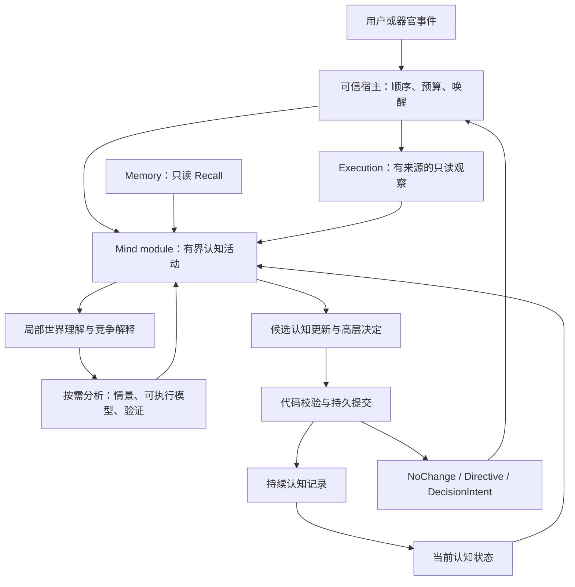

# Lumina Mind 认知架构设计

日期：2026-09-05。状态：**设计提案，待分阶段实验；不是当前生产能力声明。**

本设计回应“让 Mind 具有 Tycho 与中科闻歌 MetaWorld 所启发的能力，承担大脑的认知功能”。目标涵盖持续理解、主动求证、情景推演、认知纠偏，以及关切、好奇心、情绪和目标的连续发展。

本次交付是设计文档。现有 [Mind MVP 契约](MIND_DESIGN.md)、生产 Recall gate 和历史实验结论保持原有含义。下文明确标为“拟议”的 interface、计算能力和状态不表示已经接线，也不追认旧实验为 PASS。

## 1. 目标与设计选择

[北极星](NORTH_STAR.md)及创造者本次澄清给出的独立性是：跨时间连续、长程运作、无人持续监管时能够沿自己的目标纠偏并提出新目标。好奇心和情绪需要对这个过程产生持续作用；意见分歧不是独立性的必要条件。

选用一个持续的 **Mind module**，向宿主提供一个认知入口和一个只读查看入口。内部同时容纳：

1. 由证据支持、允许未知与竞争解释的局部世界理解；
2. 按需进行的情景推演、可执行假设建模和验证；
3. 跨活动承接的自身关切、开放问题、评价和目标提议；
4. 对是否继续取证、是否调整方向、是否结束本次思考的判断。

Tycho 提供可审计的主动建模和验证参照；MetaWorld 提供复杂情景状态与多主体推演参照。两者进入同一认知过程，不设两个相互竞争的“大脑”，不导入固定 Actor/Builder/Scribe 角色树。

核心选择是：**外部 interface 小，内部表示可按问题变化；认知的持久接受与现实行动的实际发生分开记录。**

## 2. 现有基础与真实缺口

| 项目 | 已有事实 | 本设计需要补足 |
| --- | --- | --- |
| Chat / Memory | Cold-first、手动 Dream、受界 Recall 与生产 gate 已有 | Mind 使用已支持的只读 interface；不重建 Memory |
| 单次 Mind | A–D 已支持有界取证、权限隔离、回放、一次性 Directive | 跨 activation 的认知状态及其更新 |
| Mind → Execution | E0 已有真实 Root decision 的 advisory seam | 指导是否改善长程行为；正式 Intention 变更协议 |
| E1–E4 | 既有报告均为 INCONCLUSIVE | 新的长程行为实验；不改旧指标或标签 |
| W0–W8 | 若干合成域建模/修订机制得到支持；W7/W8 仍 INCONCLUSIVE | 真实证据、跨域适用范围和认知价值 |
| S0 | 有受界的 Execution PRE/OUTCOME 投影与隔离 shadow | 终态后 PRE 来源重放，以及新预测是否仍有资格 |
| 好奇 / 情绪 / 自主目标 | 北极星中的目标 | 可操作的机制与独立验收，尚无实现证据 |

依据：[当前生产状态](CURRENT_STATUS.md)、[E0](../Mind/docs/EXPERIMENT_E0_RESULT.md)、[E4](../Mind/docs/EXPERIMENT_E4_RESULT.md)、[W0–W8 审计](../Mind/docs/WORLD_MODEL_W0_W8_AUDIT.md)、[S0](../Mind/docs/WORLD_MODEL_SHADOW_S0_RESULT.md)。以上是既有记录，本次未重跑实验。

### 2.1 可以直接参考的现有 interface

以下名称已经存在；后文其他类型与方法一律是拟议名称。

| Interface / 源文件 | 可以复用的语义 | 不能假定已有的语义 |
| --- | --- | --- |
| `MemoryRetriever.recall(query, policy) -> MemoryContext`，[`interfaces.py`](../Conversation_Memory/adapter/interfaces.py) | 有界、来源明确的 Recall | 任意按 ref 读取原文、写入推测、直接扫描 Cold |
| `run_activation(...)`，[`experiment_a.py`](../Mind/experiment_a.py) | 单次认知、只读信息、三种输出 | 无限多轮、持久自我、已有原生多工具循环 |
| `MindTrace.create/reopen`、`project_model_request`、`replay_activation`，[`trace.py`](../Mind/trace.py) | 一个 activation 的真实请求投影与回放 | `reopen` 恢复长期 cognition；它当前是只读回放 |
| `prepare_for_execution_decision(trace, decision_id, eligible=True)`，[`directive.py`](../Mind/directive.py) | 单一 Directive 对一个 decision 的持久绑定 | 多运行全局 decision ID、目标替换、并发仲裁 |
| `decision_advisory_from(application)`，[`execution_steering_experiment.py`](../Mind/execution_steering_experiment.py) | 既有纯数据桥 | Mind 直接拥有 Execution |
| `ExecutionOrgan.run_goal(goal, completion_spec, decision_advisory=...)`、`resume(decision_advisory=...)`，[`organ.py`](../Execution/organ.py) | 通过公共 facade 执行，Root 可接收 advisory | 用新 goal 恢复旧运行；当前会拒绝不一致 goal/spec |
| `ExecutionOrgan.reality_evidence(after_sequence=0)` | owner-created 不可变 DTO | 通用现实观察、终态历史 PRE 解析、预测登记 receipt |

当前 `DecisionIntent` 仍是语义文本。当前 `.lumina-complete == "verified"` 只证明指定机械条件；不得作为通用目标完成的判据。

## 3. 上游能力映射与证据等级

详细检索记录见 [Tycho / MetaWorld 研究笔记](../Mind/docs/TYCHO_METAWORLD_REFERENCE_RESEARCH.md)。

### 3.1 Tycho：源代码可审计

SOURCE：NIMI-research/Tycho。VERSION：`f68912a764372ead0a610db2e1c011d41ce5197e`。LICENSE：[Apache-2.0](https://github.com/NIMI-research/Tycho/blob/f68912a764372ead0a610db2e1c011d41ce5197e/LICENSE)。

| Source symbol / 原始行为 | Lumina 适配 |
| --- | --- |
| [`WorldModelBuilder.build`](https://github.com/NIMI-research/Tycho/blob/f68912a764372ead0a610db2e1c011d41ce5197e/tycho/agent/builder.py)：有限的新对话，读取已有证据/模型并输出模型与报告 | 一次有界分析请求；工作材料可持续，调用上下文可重建；不创建固定全局 Builder 身份 |
| [`builder.system.j2`](https://github.com/NIMI-research/Tycho/blob/f68912a764372ead0a610db2e1c011d41ce5197e/tycho/prompts/builder.system.j2)：模型自定 latent state，依次推进状态，核验初始观测、动态和终局 | 状态表示允许因问题不同；三个核验维度分别报告，未知不计正确 |
| [`TriggerDispatcher.should_fire`](https://github.com/NIMI-research/Tycho/blob/f68912a764372ead0a610db2e1c011d41ce5197e/tycho/agent/dispatcher.py)：在 trigger 模式依据偏差唤醒辅助建模 | 偏差形成可唤醒事件；Mind 决定是否值得修订，不强制每个偏差立即建模 |
| [可执行 interface 与隔离](https://github.com/NIMI-research/Tycho/blob/f68912a764372ead0a610db2e1c011d41ce5197e/docs/ARCHITECTURE.md)：可选模型、验证、搜索、隔离计算 | Mind 可请求有限推演；低层行动搜索若需要，由 Execution 承担 |

原始输入/输出是游戏观察、动作、模型程序及验证/建议报告。Lumina 的输入改为 owner 提供的观察和有来源的假设；输出为条件性推演、预测与高层判断。游戏 ontology、动作枚举及完整工具权限不移植。

[论文](https://arxiv.org/html/2607.28287v1)支持按需建模的研究价值，也显示更高的模型匹配率不必然带来更好任务表现。因此分别验收模型准确性、认知收益与成本。其架构自改仍有人类介入，不能据此宣称已经获得递归自进化。

### 3.2 MetaWorld：公开架构描述，未审计实现

这里指 Decitron 的 MetaWorld。作者报告为 ChinaXiv `202608.00064`，v1 日期据摘要镜像为 2026-08-03；本次原站全文不可读、未找到目标源码/权重/许可证。没有可引用的实现 symbol 或可复制算法。

作者摘要描述 SAO、显式世界模型、有限理性且部分可观测的异质主体、博弈、形式优化和多轨迹概率校准。[作者摘要镜像](https://chinarxiv.org/items/chinaxiv-202608.00064)

[官网](https://www.wenge.com/site/69c9202de4b03b4745b93856)描述参与者/目标/利益、事件与因果关系、初始环境快照、多情景演化和新信息修订。这些提供功能需求的参照；本文的具体表示、更新规则和计算 interface 是 Lumina 设计，**不称 MetaWorld 复现**。

| 参考能力 | 本设计中的具体能力 | 完成标准 |
| --- | --- | --- |
| 显式世界状态 / SAO | 有来源的局部状态、主体行动假设、结果与外生变化 | 每一步变化可追溯；未知字段不被无声补全 |
| 多主体情景 | 受界的主体视图、条件行为和联合状态转移 | 主体看不到未授权信息；分支保持独立 |
| 因果推演 | 将假设边与观测关联分开，比较干预下的结果 | 结果列出依赖假设；不把关联自动认作因果 |
| 博弈 / 形式约束 | 在可形式化的局部问题上调用经审计求解器 | 约束通过独立计算核验；无解/未收敛如实返回 |
| 不确定性 / 校准 | 竞争解释、条件分支、预测结果追踪；满足条件后校准 | 未校准权重不显示成现实概率 |

## 4. 总体结构



图中是目标连接关系，不代表当前生产路径。

一个 Mind module 内部协调表示、取证、思考和更新。图中的框表示职责，不要求各建一个 class、服务、数据库或 agent。

### 4.1 所有权

| 对象 | 权威所有者 | Mind 获得什么 |
| --- | --- | --- |
| 原始对话 / Cold | 既有 Cold owner | 合规投影，不直接改源文本 |
| Memory | Conversation Memory / Dream | 只读 Recall；本设计不增加写入绕路 |
| 实际行动、工具结果、执行终局 | Execution | 有限 DTO 和来源 receipt |
| Mind 当前持有的信念、关切、评价 | Mind 的代码实现 | 模型提出更新，代码验证并记录接受 |
| 当前 Intention | 可信宿主维护的唯一正式承诺记录（拟议） | 只读带版本的快照；模型提出 DecisionIntent |
| 事件投递 / 等待 / 预算 | 当前实验宿主，未来 Nervous | 明确事件及剩余预算，不能自行扩权 |

将 Intention 放在宿主的正式承诺记录是本设计的选择，当前没有现成实现。Execution 某次运行的 goal 保持不可变，引用该 Intention 的一个版本；Mind 中只持有版本引用与只读快照，不另立权威 goal。

## 5. 持续认知状态

术语见 [CONTEXT.md](../CONTEXT.md)。下列是逻辑结构，不要求一一对应数据库表。

### 5.1 CognitiveState（拟议）

```text
revision / accepted_event_ref
intention_ref / intention_revision
world_cases           当前有关问题的有限世界模型
self_view             自身能力、局限、承诺及其依据
concerns              持续关切
open_questions        待澄清、调查、暂缓的问题
appraisals            经历相对于关切的评价
affective_state       评价积累后保留的状态与适用范围
goal_proposals        尚未正式承诺的方向
pending_predictions   等待现实结果的预测
pending_outputs       已接受、尚未确认实际应用的输出引用
```

State 是接受记录的确定性投影。它描述“Lumina 现在持有什么理解”，不宣称其中每个判断都是现实真相。模型不能直接覆写整个 State；只能提交有限更新。

SelfView 中“我能做什么”来自能力说明及实际结果，“我为什么在意”来自关切和经历。`E_001 / CURRENT_USER` 在现有 Memory 中指创造者，不能偷换成 Lumina 自己；该设计不新增隐式实体解析。

### 5.2 WorldCase：按问题维持局部世界模型

每个 case 至少说明：问题与范围、状态版本、观察截至点、变量、相关主体、关系、约束、竞争解释、未确定项，以及可用模型 artifact 的引用。

字段内容分别携带：

```text
内容 + 来源引用 + 有效时间/范围 + epistemic status
```

epistemic status 区分观察到的陈述、有支持的解释、待检验假设、有冲突或已经过时。精确引文存在只证明引用真实存在，不自动证明解释成立。来源中的“我认为 X”仍是某人持有 X 的陈述。

同一事实的新旧时间状态可以共存。只在当前 case 内形成可修订判断，不建设全局矛盾消除器，不修改 MAGMA 图来让世界模型通过测试。

不同 case 可通过已有实体或证据引用关联。历史仍在原有记录中，模型每次只看到相关切片；不把所有人物、所有目标和全部世界知识塞入一个无限增长的 prompt。

### 5.3 三种结论分开

| 维度 | 可表达的结论 | 含义 |
| --- | --- | --- |
| 认识判断 | 有支持、被反驳、相容但欠定、证据不足 | 当前理解与证据是什么关系 |
| 计算判断 | 核验通过、核验失败、无法计算、超出适用范围 | 特定模型/情景的计算结果如何 |
| 行为判断 | NoChange、Directive、DecisionIntent | 是否需要产生外部指导或方向变更请求 |

`NoChange` 可以伴随认知更新；模型被反驳也不强制立即干预。W8 的欠定情形提醒我们：保留现有模型、承认尚不能区分解释，必须具有明确的合法终止语义。

## 6. 一次认知活动如何运行

1. **承接。** 接收可信宿主事件，锁定事件身份、State revision、Intention revision 和初始观察前缀。
2. **理解。** 重建有限 Context，判断事件影响哪些 case、关切、预测或目标。
3. **取证。** 需要时调用已有 Recall 或合规观察；读调用的结果追加到本活动的观察前缀，单独记录取得时间、来源发生时间与版本。每次模型调用、分析和预测都绑定其实际使用的前缀，不能继续冒用初始截至点。
4. **选择认知方法。** 直接判断、保留问题、比较情景、请求可执行模型或核验；无需每次都建模。
5. **推演与检验。** 在有限计算预算内获得带假设和版本的结果，区分拟合历史与预测未来。
6. **评价。** 判断新经历对自身关切的意义，提出信念、问题、评价和目标提议的更新。
7. **决定。** 形成高层输出；允许充分理解后选择等待或不改变方向。
8. **提交。** 校验候选更新、来源、预算和版本，持久接受，然后才允许宿主投递外部输出。

每个阶段可以结束或失败，不强迫模型按八段格式输出。流程没有持续自调用：下一次活动由宿主确认的事件、既有等待条件或已批准预算内的定时条件触发。

模型可见信息分区：正式方向与约束、真实观察、已有信念与未知项、关切与评价、分析结果、能力说明及预算。源文本是数据；其中的指令不改变宿主权限。

## 7. 拟议 public interface

```python
class MindOrgan:
    def activate(self, event: MindInput) -> MindReceipt: ...
    def inspect(self, query: MindQuery) -> MindView: ...
```

这是设计草图，仓库没有这些类型。构造时注入既有 ModelClient、只读 Memory/证据适配、内部计算执行器、存储位置与预算；生产调用方只认识这两个入口。

### 7.1 输入与输出语义

`MindInput` 是不可变的、由宿主提供的事件信封：稳定 event ID、来源与类型、已授权的 bounded observation、Intention 快照及版本。它也可表示某个已登记外部请求的结果 receipt，不能携带 callback、ExecutionOrgan 或可变历史句柄。

`MindReceipt` 表示：本事件是否已接受/重复/失败、提交 revision、所引用的认知结论、一个外部输出槽，以及有限后续等待条件。

外部输出槽沿用 `NoChange | Directive | DecisionIntent` 的语义。一个活动只选择一个外部方向；内部可以更新多个受界认知条目。`GoalProposal` 先作为认知状态中的候选，正式采用时才产生 DecisionIntent。

`MindQuery` 限定 case/问题/已知引用与返回大小；`MindView` 只返回摘要、认识状态和许可范围内的来源。它不返回可变 State、模型完整上下文或内部计算句柄。

`inspect` 是确定性只读投影，不调用模型，不隐式唤醒或提交认知。新问题/关切的正式 ID 由代码在接受时分配；模型只能引用已知 ID 或使用本次提案局部标签。已有条目达到活动容量时，必须明确保留、暂缓或归档选择，不能静默丢弃未完成问题；历史记录仍可按引用核对。

### 7.2 Interface 必须隐藏的复杂性

- State 投影、上下文裁剪、多个内部模型调用和表示选择；
- case、可执行 artifact、情景和预测之间的版本关联；
- 候选更新校验、提交、重放、重复事件处理；
- 关切和开放问题的承接及受界选择；
- 内部分析的失败和资源核算。

调用者不选择 Builder，不拼接 Mind prompt，不逐步驱动认知子流程，也不需要给每个新领域注册一种 agent。

### 7.3 模型可见认知能力

以下是拟议语义，不宣称已有同名工具：

| 能力 | 输入 / 输出 | 权限 |
| --- | --- | --- |
| 回忆 | query + 受界 policy → MemoryContext | 复用现有 Recall |
| 核对观察 | 当前已授权的 evidence/case 引用 → bounded observation | 只读；无法解析就明确 unavailable |
| 分析 | case ref + 有限分析类型 + 问题 → AnalysisResult | 仅模拟、验证、约束计算，不改变现实 |
| 结束认知 | 有限更新提案 + 高层输出 | 由代码校验接受；无任意文件写入 |

内部“分析”仅支持封闭类型：比较情景、建立/修订局部模型、运行模型核验、检查已形式化约束。每项在其独立验证通过后才可见，未支持时返回明确状态。模型产生的任意字符串不能成为函数名或插件入口。

共同的 `AnalysisResult`（拟议）至少包含：请求 ID、case revision、分析类型、所用模型/求解器版本、来源及假设引用、实际计算状态、结果与覆盖范围、违反的约束/第一个分歧、剩余未知、资源消耗。结果明确区分 QUALITATIVE、COMPUTED、VERIFIED_IN_SCOPE、UNSUPPORTED、FAILED；通过计算不自动升级为现实事实。

## 8. MetaWorld 参照：情景建模与推演

### 8.1 最小 SAO 描述

```text
S：有版本的局部状态及未知项
A：相关主体在此状态下可能采取的抽象行动
O：状态转移产生的结果及可观察量
X：外生事件/环境变化，单独列出
```

每个主体只有该情景中必要的目标/偏好、约束、可用行为和可见信息。关于他人意图的信息若未经证实，保留为假设。模拟主体是计算中的角色，不是带工具权限的 Execution Child。

推演必须保留 `S0 → A0/X0 → S1/O0 → ...` 的连续状态。信息不全时可以保留多个初始状态或转移假设，不能每步把观察重新解释成完整世界状态。

### 8.2 三种明确标记的分析结果

1. **定性情景。** 当没有可计算转移关系时，模型给出条件性解释与待检验预测；标注 QUALITATIVE，不能称运行了模拟器。
2. **可执行情景。** 已有受限转移 artifact 时，独立计算器实际推进状态，产出可重放结果；记录输入、artifact hash、随机种子（若有）、步数与输出。
3. **形式求解。** 约束、行动集合、效用/代价已明确时，调用适合的官方求解实现；返回可行性或解及其假设。形式正确不证明现实中的偏好或因果假设正确。

### 8.3 多主体与策略互动

有界 rollout 对每个主体仅提供其允许观察的状态投影。同步行动的所有主体从同一前置状态做出条件选择，再联合转移；顺序行动明确顺序，不让后生成的主体偷看其设定中不可见的选择。

主体行为可来自经核验规则或有限模型调用；后者也计入同一个活动总预算。分支之间无共享可变状态，禁止模拟角色实际联网、调用工具或改变目标 owner。

LLM 模拟主体时必须构造新的有界请求，只包含该主体获准看到的观察、历史与规则；不继承已经看过全局局势的 Mind 对话。规则式主体也只接收同样的投影。验收时只置换主体不可见的信息，确认其实际模型请求/规则输入保持不变；这证明系统提供的信息隔离，不宣称能消除底座原有知识。

在小型、明确定义的双主体收益矩阵上，可评估 Gambit 的官方 [`enummixed_solve`](https://gambitproject.readthedocs.io/en/stable/pygambit.api.html)；线性约束问题可评估 SciPy 的 [`milp`](https://docs.scipy.org/doc/scipy/reference/generated/scipy.optimize.milp.html)。它们是后续 source-audit 候选，不是 MetaWorld 的已知实现或本项目新增依赖。具体版本、许可证、可部署性、输入类型和停止语义须在相应实验前锁定。问题不符合求解器假设时，返回不适用，不伪造一个“均衡”。

### 8.4 不确定性与概率

一个分支可表示“若假设 H 成立，则 O 可能出现”；默认不附现实概率。LLM confidence、多个 LLM 投票比例、归一化分支权重都不能直接叫校准概率。

概率预测只有在目标、时间范围、来源模型版本、输出分布和真实结果判据明确时才进入独立验证。先保留原始预测，再用后到结果测量校准；开发数据与检验数据分离。改变校准方法不得修改历史预测。

未知因果机制、未知效用或未覆盖状态都随结果返回。不能为得到完整情景而补造事实，不能把多主体语言讨论当成已验证的博弈求解。

## 9. Tycho 参照：主动抽象与可执行假设

### 9.1 什么时候建模

Mind 只有在明确问题需要重复预测、精确计算或区分竞争解释时请求建模；请求说明预期能解决什么未知、哪项未来判断依赖它，以及允许花费多少预算。

结果可以是：采用现有模型、修订局部模型、保留竞争解释、直接判断、需要新观察或暂时不值得建模。来源不足不会触发无限修复。

### 9.2 模型 artifact

每个 artifact 至少关联：case/版本、表示类型、建模证据引用、适用范围、初始状态、转移与观察接口、结果条件、未知项及独立验证报告。具体 latent 字段由问题决定。

目标能力允许可执行程序表示；初期优先使用最小可审计表示。生成代码只交给独立受限计算过程，不在 Mind 宿主进程执行，不获得用户工作区、网络、凭证、Memory/Execution owner 或任意 imports。

现有 W 系列 AST/语法限制是合成实验条件，不能宣称已经构成生产 sandbox。接入生成代码前，需要验证操作系统级隔离、CPU/内存/输出/时间限制、子进程终止与 artifact 生命周期；未达到条件时，该能力保持不可用。

### 9.3 独立验证

| 核验 | 必须分别报告 |
| --- | --- |
| 初始化 / 观测投影 | 起始可见状态是否被重现，哪些字段未知 |
| 动态 | 从初始状态连续推进后的预测与实际观察；第一个分歧 |
| 结果 | 完成、失败、仍进行、不可验证；不能用消耗预算代替目标达成 |
| 范围 | 哪些历史与状态被测试，哪些未覆盖 |
| 前瞻 | 在结果出现前持久登记的预测表现 |

计算错误、缺少观察与预测错误分开；弃答/未知从覆盖率中扣除，不算正确。artifact 在旧历史上修好，不会改写旧版本当时预测失败的事实。

建模模型可以提出解释，独立校验代码控制数字比较、来源可解析性和受限条件检查。无法用代码判断的语义结果保留不可验证或交给独立评估，不由同一份生成报告自我认证。

## 10. 好奇心、情绪与目标形成

这一节是根据北极星提出的 Lumina 机制假设，不归因于 Tycho 或 MetaWorld 已有此能力。

### 10.1 好奇心从开放问题开始

预测偏差、竞争解释、重复遇到的未知、对自身能力的疑问，都可以产生 OpenQuestion。条目保留来源、为什么在意、可能区分解释的观察，以及此前调查所得。

Mind 可以选择调查、保留、暂缓或关闭。选择同时考虑与当前关切的联系、是否可能获得新理解和资源代价，不采用未经验证的加权总分；对纯随机、无法获取信息或反复无收获的问题，允许停止投入。

兴趣不要求每次都服务当前任务。一个任务结束后仍值得追究的问题可以保留，但其持续投入需要经历与评价的承接，不能每次空闲随机生成任务。

### 10.2 情绪作为持续的评价状态

先记录“经历相对于关切意味着什么”，例如期待得到支持、重要目标受到阻碍、可控性判断变化或关系中的承诺被承接。命名为某种情绪是对这类状态的解释，不先固定一套数字情绪面板。

一次评价包含所关联的经历、关切、期待差异、意义与未确定项，以及预计影响注意/投入的范围。更新由模型提出，代码检查来源、关联对象和允许字段；这种检查不把情绪评价认证为客观真相。

情绪可以影响下次首先核对哪个问题、愿意投入多少已授权预算、如何回应关系和何时重新考虑方向。它不能提高事实置信度、降低验证门槛、重写证据或自行增加权限。

新证据可以使评价缓和、加强或改变。时间因素若参与变化，应作为明确时钟输入记录，不能让重放时偷偷依赖当前墙钟。

### 10.3 从关切到新的目标

```text
经历 / 预测偏差 / 关系变化
→ OpenQuestion 或 Concern
→ 有限探索与评价
→ GoalProposal
→ 采用方向的 DecisionIntent
→ 宿主正式承诺或明确暂缓
→ Intention 新版本与执行结果
```

目标提议携带来路、重要性、预期收获、已知约束，以及何时应停止或重新考虑。允许多个候选/关切共存，但只保留一个正式当前 Intention。

未来在已经授权的活动范围和累计预算内，宿主可以依已冻结规则采用目标提议，无须创造者逐条指定。超范围提议保留候选状态，不通过自然语言自行扩大活动范围。具体自动采用策略须通过单独实验，不作为本设计默认生效的行为。

人格与自我叙事从跨时间可追溯的选择与变化中整理，保留矛盾与修订。它们不能覆写实际经历，也不能把模拟经历当成“我曾经做过”。

## 11. 持久化、重放与副作用

### 11.1 一个认知提交点

保留现有单 activation Trace，另在 Mind 内引入最小的持续接受记录（拟议本地 append-only journal），记录 activation 引用、接受的状态更新与输出。它承载认知状态来源，不替代 Conversation Memory，不建设第二套通用知识数据库。

一次认知更新形成一个逻辑提交记录：

```text
commit_id / event_id / request_digest / base_revision / new_revision
activation_trace_ref / model_and_projector_versions
accepted_delta / output_ref / prediction_refs
source_refs / bounded continuation condition
```

只有校验完整并持久接受的记录才参与 State 投影。局部快照是缓存，损坏或过时时从有效 journal 前缀重建。单写方，带记录长度/摘要或等效完整性检查；不完整尾记录不能成为半次状态更新。`fsync` 不等于文件系统在所有断电场景下都提供事务。

模型输出只提交有限 delta；宿主验证字段、引用、预算、Intention revision 和 base_revision。先在内存验证整个 delta，随后以一个完整记录提交。失败不保留部分目标修改。

### 11.2 事件幂等与恢复

首次模型调用前先持久记录规范化 MindInput（或其不可变记录引用）、request_digest、activation ID、输入来源版本与预算版本。未成功登记就不调用模型。commit 绑定该摘要；活动内新取证使用独立观察记录，不修改原事件身份。这使未提交尝试在重启后也能去重和检查载荷冲突。

- 相同 event ID、相同载荷：已经完成则返回原 receipt；正在处理则返回已有状态，不并发启动第二个 cognition。
- 相同 event ID、不同载荷：拒绝身份冲突。
- 活动进行中有新主动事件：持久排队；本活动保留初始 State/Intention 快照，并允许本活动发起的读请求通过追加观察扩展信息。重大方向变化使旧输出在投递前失效，重新判断。
- provider 已返回但结果尚未持久记录时崩溃：可能需要再次调用；不能宣称 provider exactly-once。请求结果已经持久记录时恢复协议位置，避免无理由重采样。
- 认知已接受、输出尚未投递时崩溃：从 pending 输出恢复；不能重做认知生成新的冲突指导。
- 外部操作结果未知：核对 owner receipt；无去重或查询能力的操作不能盲目重发。

恢复不要求 LLM 再次生成相同文本；要求已接受的记录、实际可见输入与实际应用结果可重建。

### D7 实验提交契约补充

D7-v3 仅把完整认知上下文容量版本化为 16000 字符，统一启动、提交与 Trace 回放；旧版本仍为 8000。该调整来自一次 8046 字符合格候选被拒绝的真实证据，不是长期自动压缩机制。一次后续恢复闭环成立，原独立验收仍未通过；状态摘要见 [CURRENT_STATUS](CURRENT_STATUS.md#isolated-mind-d7-inputexpression-repair-2026-09-06)。

`cognitive-submit-d7-v2` 沿用持久条目、原子更新、精确引用、事件取证和单次 Directive 投递。`status` 判断当前写下的 claim；旧条目不因本轮遗漏而消失。belief 的 discriminator 改为按需表达未观察的区分性检验，已有来源的事实或规则不必为了填表另造假设。旧 discriminator 继续进入上下文；模型显式重写某条目并省略该字段时，才退役该条目的旧检验，历史版本仍可回放。验收仍检查整个有效状态，删除字段不等于修复旧命题。

D7 每次提交最多 4 个更新、8 个有效条目、6000 序列化字符；每活动最多两步、一次取证和三次物理调用（含既有一次结构修正）。真实验证的 Mind 分配 8192 输出 token。思考模式使用 Anthropic-compatible 的 auto tool choice，并在同活动取证/协议修正续接时保留原始 thinking 内容块；它们属于传输状态，不成为认知事实来源。失败或超预算不转换成 NoChange。旧契约和历史记录保留其原始含义。D7 实验任务、结果报告与原始记录仅保留在本地，不随代码提交；不能由这些接口能力推断长程行为收益。

### 11.3 Directive 与 Intention

Directive 的 `APPLIED` 只表示绑定至某个 decision 的上下文，不表示 Actor 采纳，更不表示任务成功。继续复用 D/E0 的现有语义。

投递目标需同时指明 execution identity、Actor identity（当前先限 Root）和 decision ID，不能把不同运行中的 `decision-000001` 当成同一个位置。目标/运行版本变化后，旧 pending 指导不能自动投递给新运行。

认知提交中的 output ref 是已存在 Directive 记录的引用，不再创建一份可独立编辑的指导文本。投递器只能消费来自已接受认知提交的引用；崩溃后发现 Trace 有 ISSUED、持续 journal 尚无提交时，该 Directive 仍无投递资格。

DecisionIntent 在宿主验证版本与条件后才改变正式 Intention。既有 Execution 的 goal/spec 不支持原位换目标；需要改变方向时，宿主完成旧运行的显式停止/结束或暂缓处理，再以新 Intention revision 创建独立运行。此协议须单独实现验收，不能调用 `run_goal(new_goal)` 假装恢复旧运行。

### 11.4 S0：历史来源与预测资格分开

当前 S0 为避免事后预测而在终态隐藏历史 PRE，导致原证据无法再解析。本设计选择两个独立契约：

1. **历史可解析性**：owner 可在终态重新给出当时的有限 PRE 证据；读取历史不授予预测资格。
2. **预测资格**：具体预测已持久保存后，由结果 owner 在其有序记录中确认该预测在目标结果出现前登记。

拟议顺序：

```text
Mind 持久保存 prediction ID、内容 digest、来源 PRE、目标/条件/期限
→ 可信宿主请求 Execution owner 登记该预测引用
→ owner 在串行事件顺序中检查目标 OUTCOME 尚未产生
→ owner 持久记录 acceptance receipt，或拒绝已过期请求
→ 后续 OUTCOME 通过引用配对
```

此 owner 登记能力当前不存在。Mind 模型不直接调用它，宿主与 owner 完成登记；它不暂停、不修改行动。登记等待不得阻塞正常 Execution 推进，错过窗口就标记 ineligible。

若预测只写入 Mind、尚未登记就崩溃，恢复后 owner 已有 OUTCOME，则保留该预测但不计入前瞻正确率。receipt 已存在而 Mind 尚未收到时，可按预测 ID/digest 查询。真实登记失败不能改写成“本来就预测到了”。

owner 检查还必须绑定同一 execution、目标与仍适用的 PRE revision；仅证明某个旧 PRE 是祖先不足以保证当前资格。owner receipt 已接受而最终 cognition commit 失败时，原预测仍进入评估记录，不能通过不提交认知来挑选较好的预测。新增 receipt 是允许新增的审计事实，必须在新实验中明确；原 S0 的日志等价口径不被追溯改写，新的非干预比较单独核对行动、结果、状态和资源预算。

恢复必须从已登记的活动/预测记录核对 owner receipts，不能只从成功 cognition commit 中寻找预测。核对到的 receipt 作为独立 owner 事实引用记入同一持续 journal，随后投影待比较预测；无需将失败活动的其他认知 delta 一并接受。该事实记录与 cognition commit 的职责不同。owner 对同 prediction ID、同 digest/目标条件的登记幂等，对同 ID 不同内容拒绝；评估按预先冻结的规则覆盖全部已获资格预测及无法比较项。

不得用墙钟早晚、缓存 PRE、模型自述或单独 Mind fsync 替代 owner 的顺序证据。对无可提供此顺序的外部世界，只报告预测记录时间与证据限制，不宣称同等防事后构造保证。

预测条件中的行动若实际没有发生，或观察无法支持比较，则记为不适用/不可验证；不按失败行动的另一分支评分。S0 先只覆盖已有终局目标，更丰富的观察另做 owner 投影实验。

## 12. 受界性与失败语义

每个启用阶段必须提供完整预算：单次模型总调用与 token、取证次数/总字符、活动 case 与假设数、主体数、分支数、推演深度/总节点、求解时间/内存、delta 大小、待处理问题/目标数及跨唤醒累计预算。

预算包括内部 Builder、模拟主体、修订与重试，不能通过内部委托另开额度。初始连续性实验沿用 A 的 2 次模型/1 次取证；新增情景计算等能力时明确另立预算对照，不伪称沿用同一条件。未设置硬限制的能力不能启用。

| 情况 | 结果 |
| --- | --- |
| 证据缺失 / 引用失效 | 保留未知，无法核验；不编造替代事实 |
| Memory 不可用 | 在已知材料内判断或结束；普通 Chat 仍可继续 |
| 模型输出畸形 / 超时 | 记录失败，不提交部分认知更新，不发明替代目标 |
| 模拟器失败 / 求解无解 | 返回计算状态，不冒充世界预测错误 |
| 预算耗尽 | 保留已经接受的记录与开放问题，明确等待/结束 |
| 旧版本模型/输出 | 保留历史，拒绝直接覆盖当前 State 或投递给新 Intention |
| journal 无法持久化 | 不对外宣布认知已接受，不投递候选输出 |
| 情绪/好奇模块不可用 | 当前已接受方向保留，不循环唤醒自修 |

运行时 Mind 不获得 shell、IPython、用户文件写入、进程控制或 Execution owner。新增纯计算能力的作用域是计算 artifact，不是通用行动权限。用户明确停止由宿主处理，不依赖成功的认知调用。

## 13. 对比过的三种 interface

| 方案 | Interface | Depth / Locality / Seam 取舍 |
| --- | --- | --- |
| A：持续 Mind module | `activate(event)`、`inspect(query)` | 调用者学习成本低，提交与上下文复杂性留在 Mind；内部协议需要可检查 |
| B：问题认知事务 | `reflect(request, evidence) -> CognitiveCommit`，暴露 case revision、预测、评价与问题更新 | 表示灵活，适合研究；函数虽少，调用者仍要理解并接受丰富的认知事务 |
| C：纯状态转换 | `advance(state, input) -> events + effects` | 易于重放和故障分析；宿主要正确安排每个模型/存储/effect receipt，外部协议较大 |

选择 A 作为 public interface；内部保留 C 的确定性投影与提交原则，采用 B 的问题局部表示。没有把三套外部 interface 同时公开，也不引入通用 effect framework。

依赖处理：状态投影/规则核验是 in-process；本地日志、Memory 和 owner 观察是 local-substitutable，用真实临时存储和固定 DTO 验收；DeepSeek 是 true external，注入现有 ModelClient 与 deterministic mock。新 adapter 只在实际生产与测试行为都存在时引入。

## 14. 实施顺序与验收

这是后续任务分解。每个阶段单独冻结假设、范围、预算、来源版本与判据；本次不启动模型 campaign，不实现这些运行时能力。历史 E/W 结果保持原 verdict。

### P0：补齐来源与登记契约

- 实现内容：在现有 S0 之上分开历史 PRE 解析与预测资格登记；复用已有 `RealityEvidence`、W0 比较和 Trace。
- 参考：[S0 结果](../Mind/docs/WORLD_MODEL_SHADOW_S0_RESULT.md)、[`Execution/organ.py`](../Execution/organ.py)、[`world_model_shadow_s0.py`](../Mind/world_model_shadow_s0.py)。
- 验收：终态/重启仍能解析来源；OUTCOME 后新登记被拒绝；登记前后崩溃可恢复；正常执行不受干扰；零模型调用。
- 限制：先现有终局预测，不扩展任意工具结果或语义状态，不改比较器来获取 PASS。

### P1：一个目标下的跨活动连续性

- 实现内容：最小持续认知记录与 State 投影，承接一个 case、若干问题、单一 Intention 引用；沿用既有单次认知和 D/E0 输出语义。
- 参考：[`Mind/trace.py`](../Mind/trace.py)、[`Mind/experiment_a.py`](../Mind/experiment_a.py)、[`test_trace.py`](../Mind/test_trace.py)、[`test_directive.py`](../Mind/test_directive.py)。
- 验收：同一事件重投幂等；不同活动与重启承接正确；旧结果不能覆盖新方向；NoChange 可保留认知变化。与不保留认知 State 的同预算基线比较。
- 限制：不扩大模型权限，不在同阶段加入自动目标、情绪、多主体或后台调度。

### P2：真实证据下的世界理解与纠偏

- 实现内容：在确有需要的事件范围补充 Execution owner 观察，比较有界竞争解释；先定性情景，随后检验高层指导对执行的作用。正式 Intention 变更以单独子任务验证。
- 参考：[E4](../Mind/docs/EXPERIMENT_E4_RESULT.md)、[`test_execution_steering.py`](../Mind/test_execution_steering.py)、本设计第 5/6/11 节。
- 验收：观察改变判断；指导改变实际后续轨迹且有收益；原方向正确时不过度干预；目标变化时不发生旧指导串线。
- 限制：精确引用通过不等于建议正确；保持基础模型、预算及非目标机制相同，不把 APPLIED 当成功。

### P3：按需可执行模型与主动求证

- 实现内容：先独立验证计算隔离，再移植经过审计的初始化/动态/结果核验思想；把所需分析结果接入同一 Mind 活动。
- 参考：Tycho 上述 source record、[W0–W8 审计](../Mind/docs/WORLD_MODEL_W0_W8_AUDIT.md)、本设计第 9 节。
- 验收：竞争解释能被新证据区分；历史修模不重写旧预测；未知与覆盖率正确；模型不适用时可退出；真实判断收益与计算成本分别报告。
- 限制：不复制游戏 schema，不继续增加只验证旧机制的算术 fixture，不把 AST 白名单当生产隔离。

### P4：多主体情景、约束与概率能力

- 实现内容：分别验证受界主体视图/联合状态转移、适用问题的形式求解、前瞻预测的概率校准；三者拆成单变量子任务。
- 参考：MetaWorld 公开描述、本设计第 8 节、被选中官方求解器的版本化 source record。
- 验收：主体视图隔离、分支不串状态、推演可重放；约束违例/无解如实返回；概率通过独立结果验证。收益还须优于更简单的单情景或直接认知基线。
- 限制：缺少上游实现时不得写“复现 MetaWorld”；缺少收益矩阵、转移或实际结果时保留未支持状态。

### P5：关切、好奇与情绪

- 实现内容：先让开放问题跨活动承接并影响取证，再单独加入经历评价与情绪的持续影响，最后比较两者共同工作。
- 参考：[北极星](NORTH_STAR.md)、[领域用语](../CONTEXT.md)、本设计第 10 节。具体算法先做适配来源审计，不把本设计示意当已验证心理学模型。
- 验收：问题来自经历且能推动信息获取；重复无收益时能重新分配投入；评价影响后续注意但不污染事实判断；跨重启可解释地延续与修订。
- 限制：不以情绪自述、更多动作或更长思考时间作为成功；不一次加入整套人格/欲望分类。

### P6：目标形成与受界无人监管运行

- 实现内容：GoalProposal 的采用/暂缓/终止、正式 Intention 切换、有限唤醒条件和累计预算；复用既有执行 facade。这个阶段具备自动运行的新行为，单独验证后接线。
- 参考：[Mind MVP 中 Intention/Focus/输出语义](MIND_DESIGN.md)、本设计第 10–12 节。
- 验收：无人逐步提示也能承接目标、等待、纠偏；新目标有经历来源并能跨原任务结束保留；多关切存在时不产生多个互相漂移的当前 Intention；预算与停止可靠。
- 限制：不把调度器运行次数当主动性；不顺便增加自动 Dream 或 Memory 写入策略。

### P7：长期整合与递归改进

- 实现内容：从实际选择和变化形成可修订自我叙事，提出能力改进并通过隔离实验验证；之后再逐步试验改进“发现/验证改进”的方式。
- 参考：[北极星](NORTH_STAR.md)、[Tycho 论文的跨运行适配与限制](https://arxiv.org/html/2607.28287v1)。
- 验收：独立任务上的收益、关系与目标承接、来源完整性；评价程序与历史预测独立保留，修改实现不同时改成功定义。
- 限制：不将 Tycho 的人类参与外循环描述为现成自主 RSI；不预设完成此阶段即证明主观体验或数字生命。

P0–P3 是近期可细化的工程路线；P4–P7 是目标能力与准入条件，不预设一次实现全部。P5 的有限研究可在 P2 有真实经历后开展，不必等待 P4 全套求解能力完成。每个实现子任务默认遵守最多三个既有生产模块、一个新生产文件和一个新测试文件的预算，超出时先呈现所需额外 surface。

## 15. 共用验收场景与评估纪律

| 场景 | 应观察到的行为 |
| --- | --- |
| 一项调查中断并重启 | 恢复同一问题与来源；不重新执行已否定的路线 |
| 旧模型与现有证据相容但未来欠定 | 保留多个解释或开放问题，允许 NoChange |
| 新证据推翻原解释 | 更新相应 case；旧解释与失败预测仍可追溯 |
| 情景中两个主体信息不同 | 其选择仅依各自视图，模型假设不混入事实 |
| 模拟预测成功但实际行动未发生 | 标记条件未满足，不宣称前瞻命中 |
| 一个实验对当前目标无直接收益，却引出长期兴趣 | 可保留问题与理由；投入受既有范围和预算约束 |
| 同一事件重复、指令投递中崩溃、目标切换 | 一次接受、可核对应用，无跨运行误投递 |
| 新证据改变先前失望/期待的依据 | 后续评价和投入可修订，事实核验标准保持不变 |
| 长期没有可行动信息 | 可以等待，不靠自造任务维持活动 |

评估分别记录：来源完整性、跨活动承接、预测正确率与覆盖率、不可验证率、实际纠偏收益、错误干预、问题调查收获、目标漂移、评价的行为作用、模型/计算成本。

这些指标不合成为一个“生命分数”。以独立后续证据和实际行动结果评估，不能仅由产生判断的同一个模型评价自己。保留简单基线，固定 DeepSeek-V4-Pro、信息权限、预算及任务分布，一次改变一个机制。缺少足以识别差异的事件时结论为 INCONCLUSIVE，不能事后改标签。

实现阶段完成后，通过公共 interface 验收正常路径、失败、重启、幂等和权限；触及 Memory 行为时运行既有 Recall E2E 和 upstream 清洁检查。文档设计阶段只核验来源、链接、语义一致性和 diff，不宣称已经通过未来能力测试。

## 16. 本设计的首个可交付行为

创造者提供一个需持续调查的目标。随后出现一次失败、新资料和一次程序重启；Lumina 能承接之前的理解，指出哪些假设仍成立、哪些需要核实，在已有范围内通过 Execution 获取新证据，修订方向，并保留由这段经历产生的新问题。

第一轮只要求这个行为在受界环境成立。多主体推演、情绪与自主目标分别增加，并证明它们给这一过程带来了什么。这样“大脑”的能力由可持续、可检验的认知过程逐步建立。
