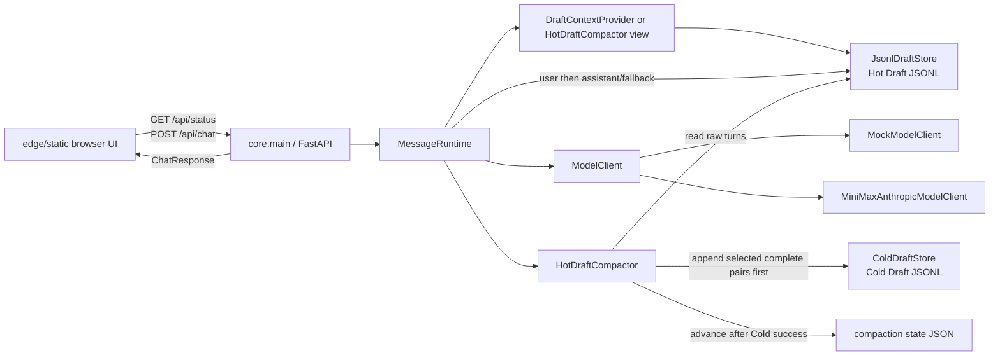

# Lumina Project Status Report

## 1. Executive Summary

Lumina 当前是一个本地 Cold Draft 对话 MVP：浏览器通过 FastAPI 调用单一同步 `MessageRuntime`，使用默认 mock 或显式 MiniMax 模型，并把对话写入 Hot Draft；超过阈值时先保存完整旧对话到 Cold Draft，再推进逻辑压缩状态。38 项测试证明主链、fallback、重启恢复及 Cold-first 失败恢复可用。整体符合 MVP 方向，未发现未来器官侵入；但 user 写失败仍会尝试写 assistant，且 preservation marker 使总上下文并非全局有界。

## 2. Current Runtime Architecture



This is the complete active runtime. No memory, recall, graph, tool, agent, or background execution path exists.

## 3. Repository Map

| Path | Responsibility | Public Interface | Depends On | Used By |
| ---- | -------------- | ---------------- | ---------- | ------- |
| `core/main.py` | Build FastAPI app, load local configuration, own runtime wiring, expose API/static files | `create_app()`, module `app`, `GET /api/status`, `POST /api/chat` | FastAPI, stores, compactor, runtime, model builder | Uvicorn, API tests |
| `core/contracts.py` | Pydantic HTTP/domain shapes and internal runtime result | `StatusResponse`, `ChatRequest`, `ChatResponse`, `MemoryTurn`, `MessageRuntimeResult` | Pydantic | API, runtime, stores |
| `core/message_runtime.py` | Single synchronous chat orchestration owner | `MessageRuntime.handle_chat()` | contracts, context provider, Hot store, compactor, ModelClient | `core/main.py` |
| `core/model_client.py` | Single model protocol, mock client, MiniMax adapter, environment-based selection | `ModelClient`, `MockModelClient`, `MiniMaxAnthropicModelClient`, `build_model_client_from_env()` | `httpx`, environment mapping | runtime wiring and tests |
| `core/env_loader.py` | Optional `.env.local` parser with process-environment precedence | `load_env_file()` | filesystem, `os.environ` | `create_app()` |
| `core/draft_context.py` | Project recent Hot turns to model role/text input | `RecentTurnReader`, `DraftContextProvider.get_recent_context()` | `MemoryTurn` | runtime when compaction is disabled |
| `core/draft_store.py` | Sole Hot Draft owner; append and recent chronological reads | `JsonlDraftStore.append_turn()`, `list_recent()` | filesystem, JSON, `MemoryTurn` | context provider, compactor, runtime |
| `core/cold_draft_store.py` | Sole Cold Draft owner; segment append, pending listing, consumed transition | `ColdDraftStore.append_segment()`, `list_pending()`, `mark_consumed()` | filesystem, JSON | compactor and tests |
| `core/hot_draft_compactor.py` | Pair-aware Cold-first logical compaction and restart state | `HotDraftCompactor.maybe_compact()`, `get_context_turns()` | Hot and Cold stores, state file | runtime |
| `edge/static/` | Same-origin browser UI and client-side rendering | `/`, `/app.js`, `/styles.css`, favicon | `/api/status`, `/api/chat` | browser |
| `tests/` | Deterministic API, model, persistence, compaction, restart, fallback, and no-leak checks | `pytest` suite | production modules, temporary paths, fake HTTP transport | validation |
| `docs/final_goal.md` | Active product direction | documentation | Cold Draft contract | maintainers |
| `docs/COLD_DRAFT.md` | Active Draft preservation contract | documentation | code and tests as implementation evidence | maintainers |
| `.env.example` / `.gitignore` | Configuration template and local-secret/runtime-data exclusion | environment keys, ignore rules | Git and local process environment | operator, env loader |

Runtime data defaults to ignored `data/draft/`; it is not part of the tracked repository.

## 4. End-to-End Chat Flow

| Step | Code | Input -> Output | Persistence / Error Handling | Test Evidence |
| ---- | ---- | --------------- | ---------------------------- | ------------- |
| 1. Request validation | `core/main.py:84-89`, `core/contracts.py:22-26` | JSON `message` or legacy `text` -> `ChatRequest`; blank -> HTTP 400 | None; extra fields are rejected by Pydantic | `tests/test_chat_api.py:39-83` |
| 2. Runtime entry | `core/message_runtime.py:30-33` | `ChatRequest` -> normalized current user string | None | `tests/test_message_runtime.py:57-74` |
| 3. Prior context load | `core/message_runtime.py:56-62` | Hot/compactor state -> role/text list | Read failure becomes empty context and internal event only | `tests/test_message_runtime.py:57-74`, `tests/test_chat_api.py:145-174` |
| 4. Model call | `core/message_runtime.py:64-78`, `core/model_client.py:61-99` | prior context plus current message -> assistant text | No Draft write yet; any model/adapter error becomes fixed fallback text | `tests/test_model_client.py:53-127`, `tests/test_message_runtime.py:83-93` |
| 5. Public object construction | `core/message_runtime.py:39-45` | phase/type/text -> `ChatResponse` | Constructed before persistence; not yet serialized | API and runtime contract tests |
| 6. Hot user append | `core/message_runtime.py:80-90`, `core/draft_store.py:28-44` | user `MemoryTurn` -> one JSONL record | Attempted first; exception is swallowed into `draft_write_failed` | Normal order: `tests/test_message_runtime.py:57-74`; failure safety: lines 109-124 |
| 7. Hot assistant/fallback append | same functions | assistant/fallback `MemoryTurn` -> one JSONL record | Attempted second even if user append failed; exception remains internal | Fallback persistence: `tests/test_message_runtime.py:83-93` |
| 8. Compaction decision | `core/message_runtime.py:92-103`, `core/hot_draft_compactor.py:48-65` | all raw Hot turns plus state -> skipped or complete-pair prefix | Runs once after both append attempts; keeps configured recent raw tail | `tests/test_hot_draft_compactor.py:29-73` |
| 9. Cold-first preservation | `core/hot_draft_compactor.py:66-73`, `core/cold_draft_store.py:23-55` | complete older pairs -> pending Cold segment | Stable ID supports idempotent retry; failure leaves state untouched | `tests/test_hot_draft_compactor.py:80-94`, `tests/test_cold_draft_store.py:38-53` |
| 10. State advancement | `core/hot_draft_compactor.py:75-90,125-144` | prior state plus marker/count -> atomically replaced state JSON | Happens only after Cold append. Failure retains Cold segment; retry reuses ID | `tests/test_hot_draft_compactor.py:97-130` |
| 11. Response serialization | `core/main.py:84-89`, response model in `core/contracts.py:36-43` | already-built `ChatResponse` -> public JSON | Draft/model failures do not change HTTP success response; internals/events are excluded | `tests/test_chat_api.py:100-142` |

The actual order differs subtly from a simple linear diagram: the public response object is built before persistence, but FastAPI serializes it only after Hot write and compaction attempts return. This does not violate Cold-first ordering, but it means `message_consumed=true` does not prove durable persistence.

## 5. Persistence Model

### Hot Draft

- Default path: `data/draft/hot_drafts.jsonl`.
- Owner: `JsonlDraftStore` only.
- Each append contains `role`, `text`, UTC `created_at`, fixed `source="chat_draft"`, and `safe=true`.
- Reads scan the file, skip malformed/non-chat records, preserve chronological order, then take the requested tail.
- The physical file is append-only. Logical compaction never truncates it.

### Cold Draft

- Default path: `data/draft/cold_drafts.jsonl`.
- Owner: `ColdDraftStore` only.
- Each segment contains opaque `segment_id`, chronological `turns`, UTC `created_at`, `source`, and `state`.
- New records use `pending_digest`; `mark_consumed()` rewrites the file through a temporary file and adds `consumed_at`.
- A repeated stable ID with equal turns/source returns the existing record; conflicting content raises a sanitized `ValueError`.

### Compaction state and recovery

- Default path: `data/draft/hot_draft_compaction_state.json`.
- State stores `summaries` (deterministic preservation markers, not semantic summaries) and `compressed_until_count`.
- Defaults are trigger above 24 raw turns and retention of 12 recent raw turns. Only complete contiguous user/assistant pairs are selected.
- Cold append precedes atomic state replacement. Cold failure leaves the logical Hot view unchanged.
- If state replacement fails after Cold append, the retry derives the same segment ID, reuses the existing Cold record, then advances state without duplication.
- New store/compactor instances rebuild Hot context, pending Cold segments, and logical state from disk; tests exercise all three restart paths.

Atomic replacement protects a single state-file update and consumed-state rewrite, but there is no transaction across Hot append, Cold append, and state. There is no process-wide or cross-process writer lock, no `fsync` durability guarantee, and reads are full-file scans. The design is suitable for the current single-process local MVP, not concurrent writers.

## 6. Implemented Capabilities

- Same-origin static browser chat served by FastAPI.
- `GET /api/status` and synchronous `POST /api/chat` with typed response models.
- Exactly one runtime orchestration class and one model protocol.
- Deterministic default mock model.
- Explicit MiniMax Anthropic-compatible adapter with fake-transport test coverage.
- Sanitized fixed fallback for provider exceptions, bad status, invalid JSON, missing text, or empty model output.
- Prior logical Draft context read before every model call.
- Restart-persistent Hot Draft JSONL and bounded recent raw-turn projection.
- Restart-persistent pending/consumed Cold Draft segments.
- Pair-aware Cold-first logical compaction with stable-ID retry.
- Restart recovery for logical compaction view and checkpoint.
- Public response and frontend boundaries that do not project Draft records or runtime events.
- `.env.local` loading with process-environment precedence; `.env.local` and `data/` are Git-ignored.

## 7. Partially Implemented or Ambiguous Capabilities

- **Bounded context:** recent raw turns are bounded, but every preservation marker is included when runtime calls `get_context_turns()` without a limit. Total model-facing context is therefore unbounded.
- **Ordered pair persistence:** user append is called before assistant/fallback append, but independent exception handling allows an assistant-only record if the first append fails and the second succeeds.
- **Consumption semantics:** Draft failures fail soft while the API still returns HTTP 200 and `message_consumed=true`; this field means request handling completed, not that both turns were durably stored.
- **Cold lifecycle:** `pending_digest` and `consumed` states exist, but no runtime consumer or digestion operation exists.
- **Real-model configuration:** the adapter is explicit, but incomplete or unsupported `real` configuration silently selects mock mode.
- **Durability/concurrency:** files survive ordinary restart, but there is no cross-file transaction, `fsync`, or multi-process coordination.

## 8. Not Implemented

The repository contains no production implementation of:

- Conversation Memory
- Conversation Graph
- Dream or digestion
- MAGMA
- Recall
- Embeddings
- Vector Search
- ContextBuilder
- ToolRuntime
- Agents
- Tasks
- Schedulers
- Workers
- PostgreSQL or SQLite graph storage
- semantic summaries, query routing, hybrid retrieval, or graph traversal

Cold Draft is preservation storage only and must not be described as long-term memory.

## 9. Invariant Verification Matrix

| Invariant | Status | Code Evidence | Test Evidence | Notes |
| --------- | ------ | ------------- | ------------- | ----- |
| 1. One `MessageRuntime` | PASS | Only class declaration at `core/message_runtime.py:16`; wired once at `core/main.py:63-68` | All runtime/API tests use this class | Repository symbol scan found no duplicate |
| 2. One `ModelClient` protocol | PASS | `core/model_client.py:16-22` | `tests/test_model_client.py` covers its implementations | `RecentTurnReader` is a storage read protocol, not a model abstraction |
| 3. One Hot Draft owner | PASS | `JsonlDraftStore`, `core/draft_store.py:18-84` | `tests/test_draft_store.py` | Compactor/runtime depend on this owner rather than duplicating persistence |
| 4. One Cold Draft owner | PASS | `ColdDraftStore`, `core/cold_draft_store.py:19-147` | `tests/test_cold_draft_store.py` | No alternate Cold writer exists |
| 5. Read Draft before model | PASS | `handle_chat()` loads at lines 33 then generates at 34-37 | `test_model_is_called_before_current_turn_is_written`; API prior-turn test | Current user is passed separately, not duplicated in prior context |
| 6. Persist user before assistant/fallback | PARTIAL | Loop order is user then assistant at `core/message_runtime.py:82-89` | Success/fallback order is covered; no first-write-only failure test | Failed user append does not stop assistant append |
| 7. Advance state only after Cold succeeds | PASS | Cold append lines 66-73; state write lines 82-87 | `test_cold_failure_does_not_advance_hot_context` | Cold-first contract is explicit |
| 8. Cold failure does not mark Hot compressed | PASS | Failure returns before `_write_state()` | Same failure test verifies unchanged context and absent state file | Public response is unchanged |
| 9. State failure is idempotently recoverable | PASS | Stable hash ID plus Cold store equal-content reuse | `test_state_failure_retry_reuses_cold_segment_instead_of_duplicating` | One Cold record remains after retry |
| 10. Restart restores Hot context | PASS | JSONL read plus state-based projection | draft-store restart, compactor restart, API restart tests | Ordinary process restart covered |
| 11. Restart restores Cold pending segments | PASS | `list_pending()` reads disk | `test_append_and_restart_pending_segment` | Pending state is storage-only |
| 12. Restart restores compaction state | PASS | `_read_state()` and `get_context_turns()` | `test_restart_restores_logical_context_and_checkpoint` | Corrupt state instead resets to empty/default |
| 13. Public API does not expose internals | PASS | Fixed model errors/fallback, typed response models, public endpoint returns `.response` only | provider failure/no-leak, fake adapter, Draft failure, conflict tests | Tests cover key/URL/path/private text; no Draft structure is in schemas |
| 14. Mock runs by default | PASS | `build_model_client_from_env()` defaults mode to `mock` | `test_default_configuration_uses_mock`, status/mock API test | No network request at import/startup |
| 15. Real model requires explicit config | PASS | Mode, provider, key, base URL, and model all required at `core/model_client.py:131-145` | complete/incomplete configuration tests | Unsupported/incomplete values fall back to mock |
| 16. Tests do not call real provider | PASS | Injected clients and test app paths | Real-adapter tests use `httpx.MockTransport`; suite passed offline | Module app creation performs no provider request |
| 17. `.env.local` and `data/` untracked | PASS | `.gitignore:9-13` | env-loader ignore test; `git ls-files` and `git check-ignore` scan | Existing local contents were not opened or modified |

## 10. Test and Validation Results

Final validation after documentation edits:

```text
python -m pytest -q
38 passed in 0.74s

git diff --check
passed (no output)
```

There were 38 collected tests, 38 passed, 0 failed, and 0 skipped. No real provider was contacted.

Coverage is strong for the intended happy path, provider fallback, Cold-first ordering, state-write retry, restart recovery, and representative no-leak values. Missing deterministic cases are called out as debt rather than inferred as guarantees.

## 11. Technical Debt

### Critical

| ID | Severity | Location | Evidence | Consequence | Recommended Direction |
| -- | -------- | -------- | -------- | ----------- | --------------------- |
| CD-001 | Critical | `core/message_runtime.py:80-90` | User and assistant appends catch failures independently | A failed user write followed by a successful assistant write creates an orphan assistant turn, violates the required persistence boundary, and can block pair-aware compaction at that offset | Gate assistant persistence on successful user persistence and add a deterministic first-write-only failure test; do not broaden scope beyond runtime/store contract |

### High

| ID | Severity | Location | Evidence | Consequence | Recommended Direction |
| -- | -------- | -------- | -------- | ----------- | --------------------- |
| CD-002 | High | `core/hot_draft_compactor.py:92-109`, `core/message_runtime.py:58-60` | Runtime requests the complete logical view; preservation markers accumulate | Main model context can grow without a global bound, conflicting with the bounded-path requirement | Define and test a deterministic total logical-context bound while preserving the recent raw tail and Cold-first rule |
| CD-003 | High | `core/message_runtime.py:39-49` | Response is fixed at `message_consumed=true` before persistence attempts | Client cannot distinguish handled-but-not-persisted from durable capture | Define exact field semantics and a tested failure contract before changing the public API |
| CD-004 | High | all three Draft files | Append/rewrite operations have no writer lock or cross-file transaction | Multiple workers can race, duplicate, overwrite, or misorder state | Keep deployment single-process; document/enforce that boundary before considering a storage change |

### Medium

| ID | Severity | Location | Evidence | Consequence | Recommended Direction |
| -- | -------- | -------- | -------- | ----------- | --------------------- |
| CD-005 | Medium | `core/draft_store.py:44-59`, `core/cold_draft_store.py:79-94`, `core/hot_draft_compactor.py:111-112` | Reads scan full files; raw Hot read has a 1,000,000-turn cap | Cost grows linearly and extreme histories can be projected inconsistently | Add deterministic size/performance boundaries before changing storage technology |
| CD-006 | Medium | `core/hot_draft_compactor.py:114-123` | Missing, corrupt, and structurally invalid state all become empty state | Corruption can trigger repeated preservation attempts or conflict without a visible recovery signal | Specify a safe quarantine/recovery policy and test it |
| CD-007 | Medium | `core/model_client.py:127-145` | Invalid explicit real configuration silently returns mock | Operator may believe real mode is active until checking `/api/status` | Add a sanitized local diagnostic or fail-fast configuration policy in a separate task |
| CD-008 | Medium | `core/main.py:84-89`, `core/model_client.py:66-72` | No application-level user-message or input-context size cap | Oversized requests can increase memory/provider cost and latency | Add explicit validated limits with API tests |
| CD-009 | Medium | `core/model_client.py:53-59` | Internally created synchronous `httpx.Client` has no close lifecycle | Reloads/tests or long-lived process lifecycle can retain resources | Give the app an explicit shutdown lifecycle without changing model semantics |

### Low

| ID | Severity | Location | Evidence | Consequence | Recommended Direction |
| -- | -------- | -------- | -------- | ----------- | --------------------- |
| CD-010 | Low | `edge/static/app.js`, `tests/test_chat_api.py:54-77` | Tests verify served assets and string presence, not browser interaction | Client-side regressions may pass backend tests | Add a small deterministic browser smoke test only when frontend behavior expands |
| CD-011 | Low | `core/cold_draft_store.py:140-147` | Read validation checks container shape but not every nested turn field | Hand-edited malformed records can be returned internally | Reuse the write validator on read in a narrowly scoped storage-hardening task |

## 12. Documentation Drift

| Document | Drift Found Before Scan | Reconciliation |
| -------- | ----------------------- | -------------- |
| `README.md` | Called the whole chat path “bounded,” while only the recent raw tail is bounded and markers accumulate | Reworded the path as synchronous and documented marker/physical-file limits plus non-transactional pair persistence |
| `docs/CURRENT_STATUS.md` | Had Complete/Known Limits/Not Started but no Partial section; omitted user-write failure behavior and `message_consumed` ambiguity | Added a code-backed Partial section and expanded current limits |
| `docs/MVP_GOAL.md` | “bounded logical Hot Draft context” can be read as a total bound | Left unchanged because it is a goal document; this report clarifies current implementation only bounds the recent raw tail |
| `AGENTS.md` | Requires a bounded main path and user persistence before assistant | Left unchanged as authority; invariants 6 and the total context bound are marked PARTIAL against it |
| `docs/COLD_DRAFT.md` | No material code conflict found | Unchanged; its marker accumulation, physical append-only, no-consumer, and no-lock limits already match code |
| `docs/final_goal.md` | No material code conflict found | Unchanged; it states product direction and the Cold-first invariant rather than claiming future memory features |

No stale class, endpoint, command, default data path, or active future-organ claim was found in README, `CURRENT_STATUS`, `COLD_DRAFT`, or `final_goal`.

## 13. Recommended Module Boundaries

The repository is only nine production Python modules plus a static frontend. Physical moves now would add churn without reducing ambiguity; boundaries should remain conceptual until a module has a second implementation or independent lifecycle.

| Area | Split Now? | Boundary Evidence | Allowed Dependencies | Forbidden Responsibilities | Local `AGENTS.md` Now? |
| ---- | ---------- | ----------------- | -------------------- | -------------------------- | ---------------------- |
| Runtime | No | `MessageRuntime` already owns only synchronous orchestration | contracts, ModelClient, Draft context/store, compactor | HTTP routing, provider configuration, storage formats, future organs | No; root rules are sufficient |
| Model Adapter | No | One protocol, one mock, one real adapter in a compact file | `httpx`, environment mapping, role/text context | Draft persistence, API response creation, retries that expose provider details | No; reconsider when a second real provider exists |
| Hot/Cold Draft | No physical move; preserve as a conceptual domain | Separate Hot owner, Cold owner, context projection, and compactor with explicit direction | contracts, JSON/filesystem; compactor may depend on both stores | model calls, HTTP, recall, semantic memory, background consumption | Not yet; root `AGENTS.md` plus `COLD_DRAFT.md` is authoritative |
| Web/API | No | `core/main.py` is a small composition root; `edge/static` is dependency-free | contracts and runtime at the Python boundary; public API only in JS | persistence internals, provider credentials, Draft IDs/events | No; endpoint surface is too small |
| Tests | No | Seven focused test modules mirror production responsibilities | public/internal test seams, temp paths, fake HTTP | real provider calls, local `.env.local`, local `data/` | No; existing root validation rule is enough |

Dependency direction should remain `Web/API -> Runtime -> Model/Draft abstractions -> local adapters`. Stores must not depend on runtime or web code, and the model adapter must not know Draft storage.

## 14. Safe Next Step

**Harden the user-before-assistant failure boundary in `MessageRuntime`.** Make a failed user append stop the assistant/fallback append, then add one deterministic test with a store that fails only its first write. Acceptance should prove no assistant-only record is created, the public response remains sanitized, no Cold compaction is falsely advanced, and the existing 38 tests remain green. This is one runtime module plus one focused test module, introduces no dependency or future organ, and directly closes the only Critical finding.

## 15. Files Changed

| File | Reason |
| ---- | ------ |
| `README.md` | Replace the over-broad bounded-path claim and expose current persistence/context limits |
| `docs/CURRENT_STATUS.md` | Separate Complete from Partial and record code-backed limits |
| `docs/PROJECT_STATUS_REPORT.md` | Add the evidence-driven architecture, invariant, validation, debt, drift, boundary, and next-step report |

No production module, test, dependency, `.env.local`, or `data/` file was changed.
